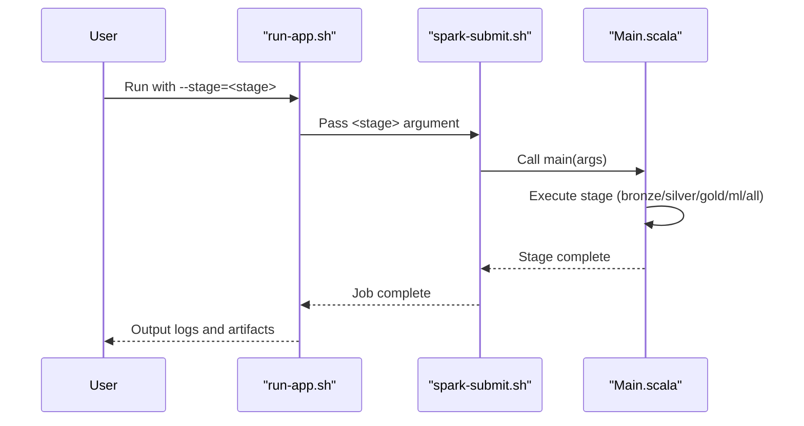
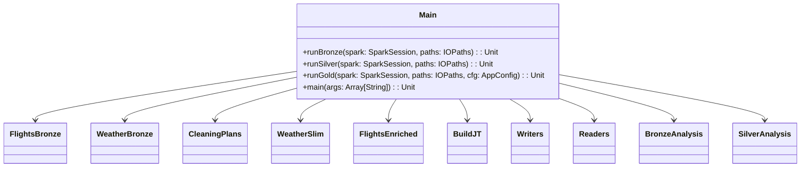
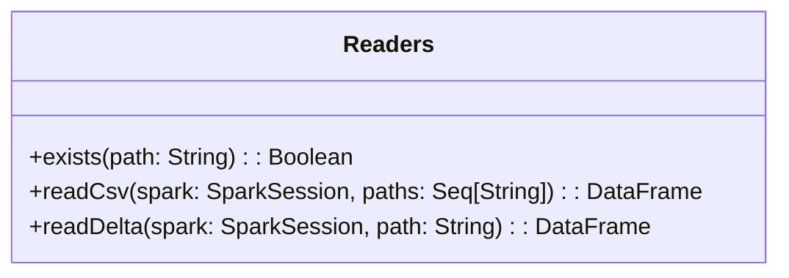

# Utilisation de l'exploration de données évolutives pour prédire les retards d'un vol

## Présentation

Les retards de vols sont fréquents partout dans le monde (environ 20 % des vols aériens arrivent avec plus de 15 minutes de retard) et leur coût annuel est estimé à plusieurs dizaines de milliards de dollars. Dans ce contexte, la prévision des retards de vols est une question primordiale pour les compagnies aériennes et les voyageurs. L'objectif principal de ce travail est de mettre en place un système de prévision des retards d'arrivée des vols réguliers dus aux conditions météorologiques. Le retard d'arrivée prévu tient compte à la fois des informations sur le vol (aéroport d'origine, aéroport de destination, heure de départ et d'arrivée prévues) et des conditions météorologiques à l'aéroport d'origine et à l'aéroport de destination, en fonction de l'horaire du vol. Les données relatives aux vols aériens et aux observations météorologiques ont été analysées et exploitées à l'aide d'algorithmes parallèles mis en œuvre sous forme de programmes MapReduce exécutés sur une plateforme cloud. Les résultats montrent une grande précision dans la prévision des retards supérieurs à un seuil donné. Par exemple, avec un seuil de retard de 15 minutes, nous obtenons une précision de 74,2 % et un rappel de 71,8 % sur les vols retardés, tandis qu'avec un seuil de 60 minutes, la précision est de 85,8 % et le rappel des retards est de 86,9 %. De plus, les résultats expérimentaux démontrent l'évolutivité du prédicteur qui peut être obtenue en effectuant des tâches de préparation et d'exploration des données sous forme d'applications MapReduce sur le cloud.
Ce travail s'appuie sur l'article : [Using Scalable Data Mining for Predicting Flight Delays](https://www.researchgate.net/publication/292539590_Using_Scalable_Data_Mining_for_Predicting_Flight_Delays)

## Diagramme de séquence pour l'exécution des étapes du pipeline ETL (*Extract, Transform and Load*)

## Diagramme de classes pour les étapes du pipeline dans Main.scala

## Diagramme de classes pour Readers.scala avec la fonction utilitaire exists

## 📊 Rapport Global ML (Généré automatiquement via CI/CD)

Le rapport complet consolidant tous les résultats de modélisation est généré automatiquement par la pipeline GitHub Actions après chaque exécution ML.

🔗 **Accéder au rapport interactif :**  
👉 https://auduvignac.github.io/flight/ml_report_all.html

Ce rapport comprend :

- les métriques de performance pour toutes les expériences (AUC, PR-AUC, accuracy, recall, precision)  
- les importances des variables (Random Forest)  
- des tableaux comparatifs (datasets, fenêtres météo, seuils, features)  
- des visualisations interactives (Plotly)  
- un résumé global et un classement des meilleures configurations  

Le rapport est automatiquement reconstruit et publié via GitHub Pages à la fin de chaque exécution CI.